# 🎓 UniSearch — Cambodia University & Scholarship Finder

> A React JS web application that helps Cambodian students discover universities, explore scholarships, and find their best academic match — all in one place.

---

## 1. 📌 Introduction

**UniSearch** addresses a real problem faced by Cambodian students: the lack of a centralized, easy-to-use platform for researching local universities and scholarships. Students currently have to visit multiple websites, compare programs manually, and often miss scholarship deadlines.

UniSearch solves this by providing a single interface to **browse universities**, **explore scholarships**, **filter by major/location/budget**, and **save favorites** — with a smart matching engine to recommend the best fit.

**Target Users:** High school graduates and current students in Cambodia looking for higher education opportunities.

---

## 2. 🎯 Objectives

1. **Centralize Information** — Provide a single platform for Cambodian students to browse universities and scholarships with rich detail pages.
2. **Simplify Discovery** — Enable filtering and smart matching so students can find programs that fit their major, location, and budget preferences.
3. **Improve Decision-Making** — Allow users to save and manage a personal wishlist of universities and scholarships for easy comparison.

---

## 3. 🗂️ Scope & Limitations

### Scope
- Browse and search all universities in Cambodia
- Filter universities by location, major, and budget
- View detailed university pages (programs, admission requirements, deadlines)
- Explore and view scholarship listings with detail pages
- Smart "Best Match" engine that ranks universities by user preferences
- Personal wishlist that persists across sessions via `localStorage`
- Fully responsive single-page application with client-side routing

### Limitations
- No real backend or database — all data is stored in static JS data files (`universities.js`, `scholarships.js`)
- No user authentication or account system
- Scholarship data is manually curated and may not reflect real-time changes
- The Best Match algorithm uses a simple weighted scoring system, not machine learning
- No Khmer language support in the current version

---

## ⚙️ 4. Methodology

### 🛠️ a. Tools & Technologies

| Tool / Library | Purpose |
|---|---|
| React JS (Vite) | UI framework and component architecture |
| React Hooks (`useState`, `useEffect`, `useMemo`) | State management and side effects |
| Custom Hooks | Reusable logic for filtering, matching, and wishlist |
| Lucide React | Icon library |
| CSS Modules (per-component) | Component-scoped styling |
| localStorage | Wishlist persistence across sessions |
| Vite | Build tool and development server |

---

### b. Use Case Diagram

**Actors:** Student (User)

The user can:
- Search for universities by keyword
- Filter universities by location, major, and budget
- View university and scholarship detail pages
- Use the Best Match tool to get personalized recommendations
- Add or remove universities and scholarships from their wishlist
- Navigate between pages using the Navbar

---


### c. System / Component Diagram

The app follows a single-root component tree where `App.jsx` acts as the central controller.

```
App.jsx
├── Navbar.jsx              (navigation + search bar)
│
├── HomePage.jsx            (hero, stats, trending unis, scholarship preview)
│   ├── Herosection.jsx
│   ├── UniCard.jsx
│   ├── ScholarshipCard.jsx
│   └── SectionHeader.jsx
│
├── UniversitiesPage.jsx    (full university list with filters)
│   ├── FilterBar.jsx
│   └── UniCard.jsx
│
├── DetailPage.jsx          (university or scholarship detail)
│   ├── UniversityDetailPage.jsx
│   └── ScholarshipDetailPage.jsx
│
├── ScholarshipPage.jsx     (scholarship listing)
│   └── ScholarshipCard.jsx
│
├── BestMatchPage.jsx       (preference form + results)
│   └── UniCard.jsx
│
├── WishlistPage.jsx        (saved items)
│   └── UniCard.jsx / ScholarshipCard.jsx
│
└── Footer.jsx
```

**Custom Hooks (shared logic):**

```
useWishlist.js          → manages wishlist array + localStorage sync
useUniversityFilter.js  → search query + filter state + filtered results (useMemo)
useBestMatch.js         → match form state + scoring algorithm + results
```

---


### d. How the App Works (Algorithm / Flow)

**Page Navigation**

`App.jsx` holds a `page` state variable (e.g. `'home'`, `'universities'`, `'detail'`). When the user clicks a nav link or a card, `setPage` is called and React re-renders the correct page. There is no React Router — navigation is handled entirely through conditional rendering.

**Detail Page Routing**

When a user clicks a `UniCard` or `ScholarshipCard`, `handleSelectItem(item)` in `App.jsx` stores the selected item in `selectedItem` state and sets `page` to `'detail'`. `DetailPage` then checks whether the item is a university or scholarship by looking for a `title` field (scholarships have one, universities do not), and renders the appropriate detail component.

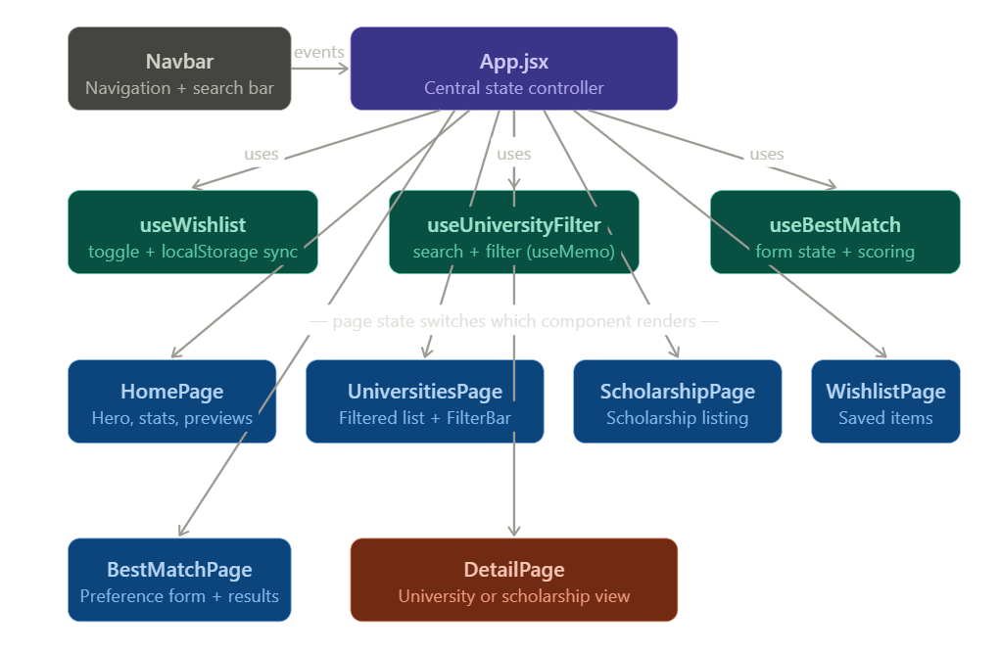

**Search and Filter Flow**

1. The user types in the search bar (in `Navbar` or `HomePage`).
2. `setSearchQuery` updates state inside `useUniversityFilter`.
3. `filteredUniversities` is recomputed using `useMemo` — it only recalculates when `searchQuery` or `filters` actually change.
4. The updated list is passed as a prop to `UniversitiesPage`, which renders the results.

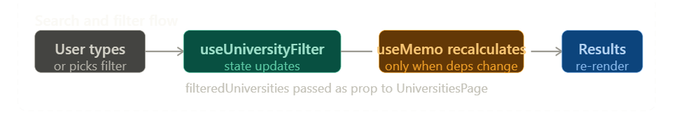

**Best Match Flow**

1. The user fills in preferred major, location, and budget on `BestMatchPage`.
2. Each field update calls `setMatchField(key, value)` inside `useBestMatch`, which merges the new value into `matchForm`.
3. When the user clicks "Find My Matches", `runMatch()` filters the university list by the three criteria, then sorts results by a scoring system (major match = 3 points, location match = 2 points).
4. `matchResults` is set and passed to `BestMatchPage` for display.

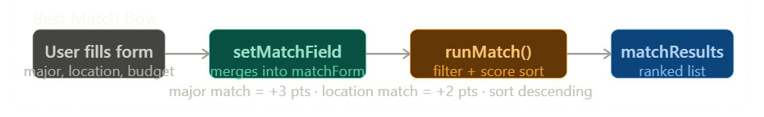

**Wishlist Flow**

1. Every `UniCard` and `ScholarshipCard` receives `isWishlisted` (boolean) and `onToggleWishlist` (function) as props.
2. When the user clicks the heart icon, `toggleWishlist(id)` is called on `useWishlist`.
3. The hook checks if the ID already exists in the array. If it does, it removes it; if not, it adds it.
4. `useEffect` inside the hook syncs the updated array to `localStorage` every time it changes, so the wishlist survives a page refresh.


---

## 5. Results

**Completed:**
- All 6 pages are fully functional (Home, Universities, Scholarships, Best Match, Detail, Wishlist)
- Search and multi-filter system works correctly
- Best Match scoring algorithm filters and ranks universities based on user input
- Wishlist persists across page refreshes using localStorage
- Responsive navbar with mobile drawer menu

**Not Completed / Known Issues:**
- No live data, not reflect real-time changes
- Scholarship filter/search page is minimal compared to the university listing
- No Khmer language toggle

---

## 6. Conclusion

UniSearch successfully achieves its three main objectives: 
- Lets students explore Cambodian universities in one place
- Recommends matches based on their personal criteria
- Allows them to build a saved list for easy comparison. 

Through this project, Our team gained hands-on experience with 
- React component architecture
- Custom hooks for shared state logic
- Performance optimization using `useMemo`
- LocalStorage for data persistence. 

The biggest challenge was managing state that needed to be shared across multiple pages without a global state library — which was solved by lifting state up to `App.jsx` and passing it down through props.

---

## 7. Demo

### 📄 Home Page

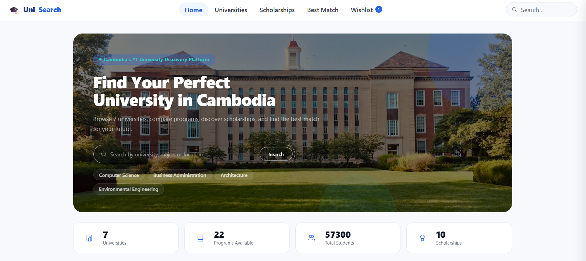

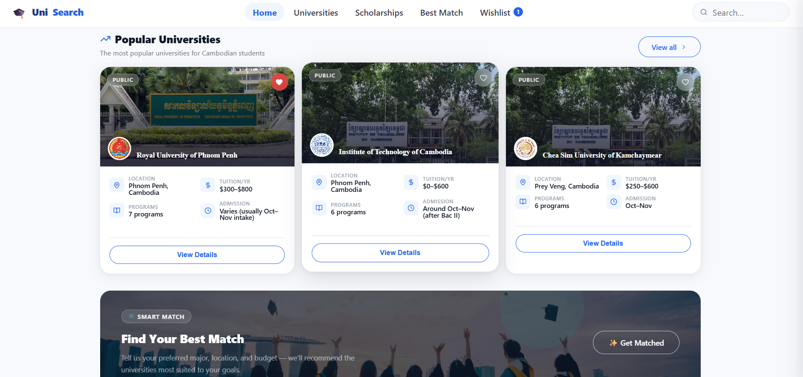

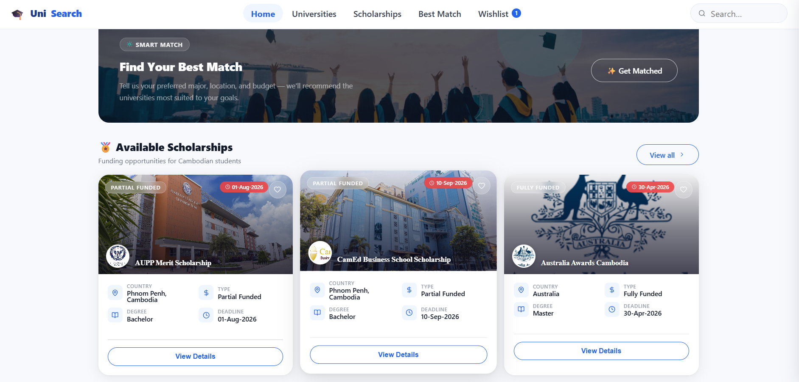

### 📄 Universities Page

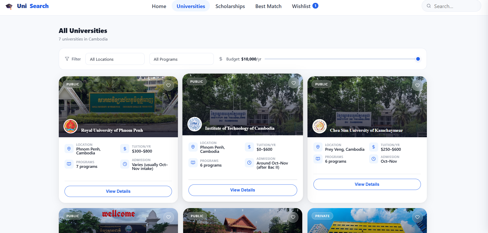

### 📄 University Detial Page

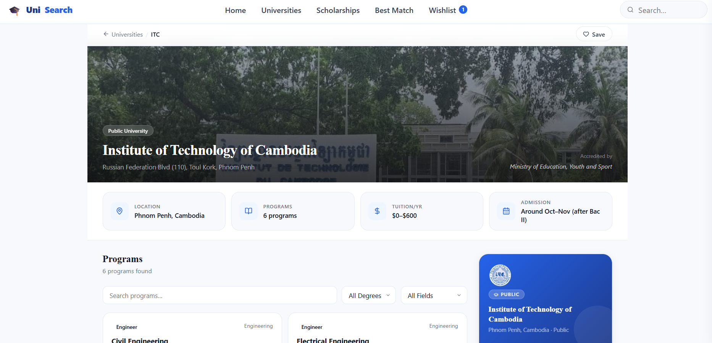

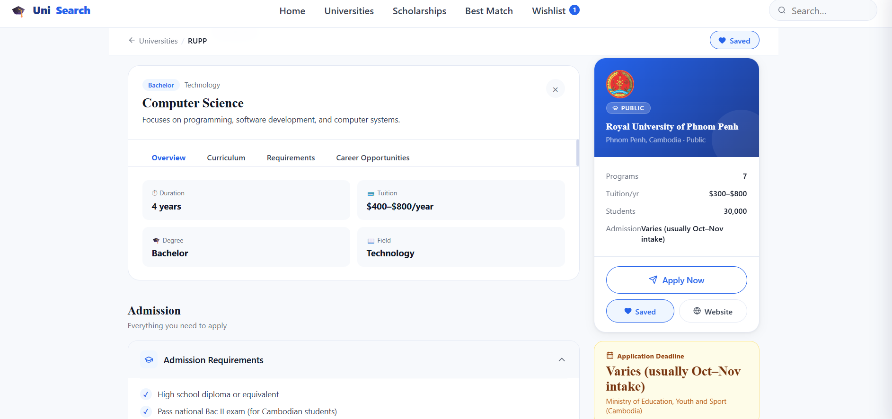

### 📄 Scholarships Page

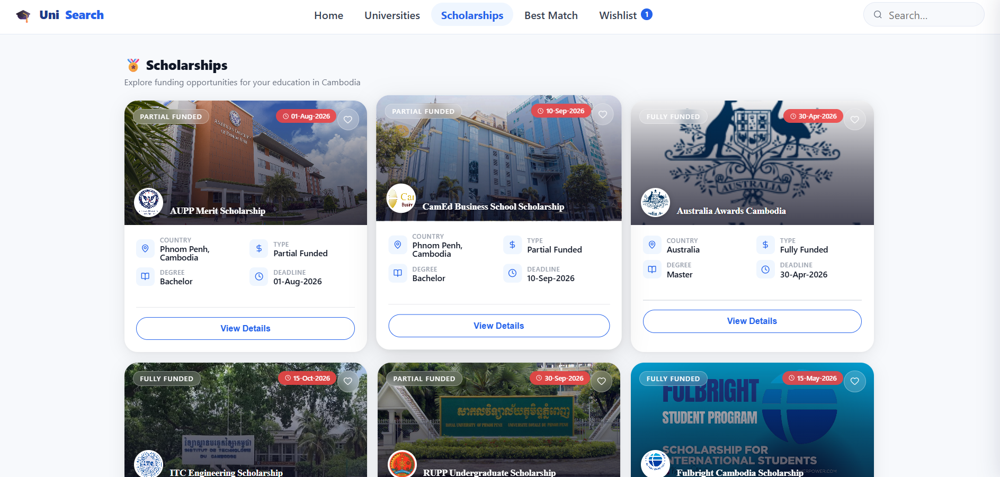

### 📄 Scholarship Detial Page

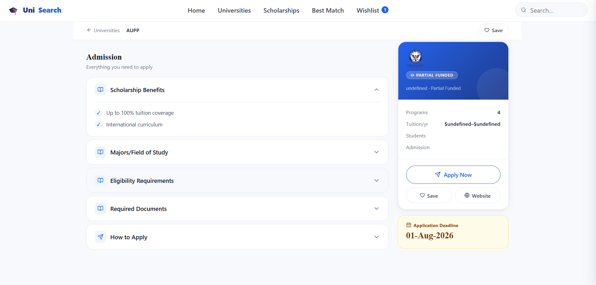

### 📄 Best Match Page

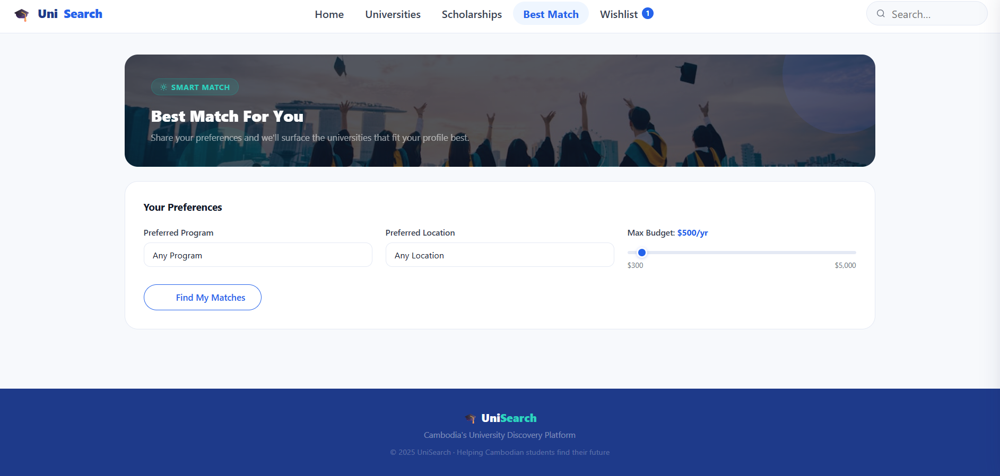

### 📄 Wishlist Page

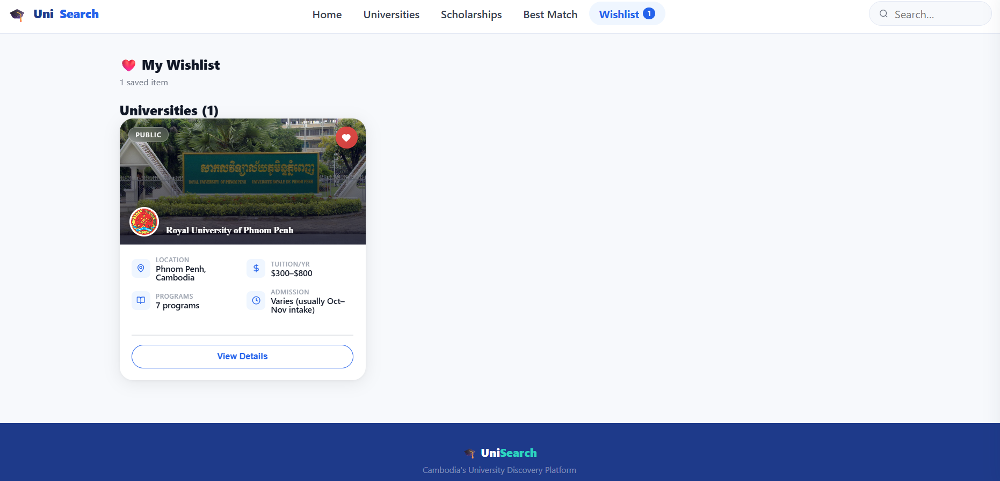


---
